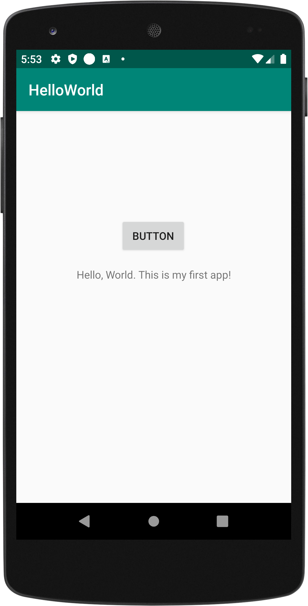
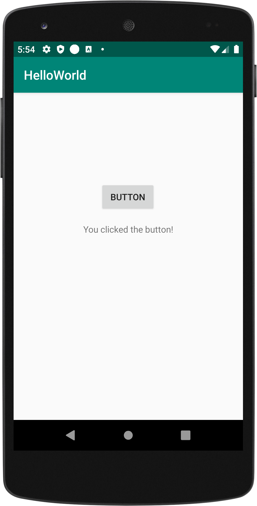

# Hello World

**CIS 3515 Introduction to Mobile Application Development - Assignment 1**

This application was made to practice working with views and event listeners in Android. When the button is clicked, 
a message is displayed notifying the user they have clicked the button.
 
 
 
 
